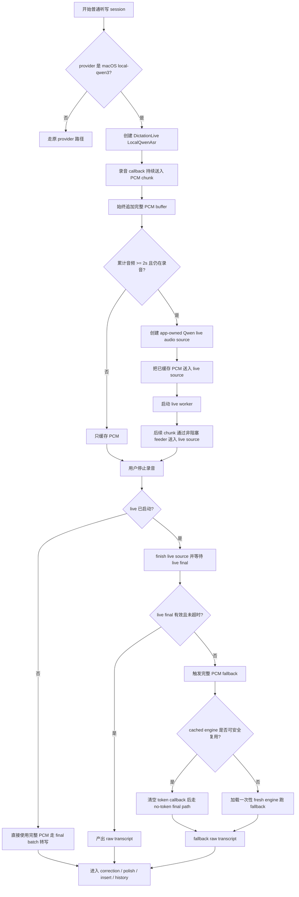

# 本地 ASR 快速出结果实现说明

Status: implemented
Date: 2026-07-06
Scope: macOS `local-qwen3` 普通听写
Related requirements: docs/issues/local-asr-fast-live-results-fallback/local-asr-fast-live-results-fallback-requirements.md
Related technical spec: docs/issues/local-asr-fast-live-results-fallback/local-asr-fast-live-results-fallback-technical-spec.md
Related issue map: docs/issues/local-asr-fast-live-results-fallback/local-asr-fast-live-results-fallback-issue-map.md

## Summary

这次改进的核心是把普通本地 Qwen ASR 从“停止录音后再整段识别”改为“录音过程中先启动 live ASR，停止录音时优先 finalize live 结果；如果 live 路径不可用或结果不可靠，再使用完整录音 PCM 做 batch final fallback”。

用户侧的变化是：中长录音停止后等待 ASR 的时间明显减少；失败兜底仍然存在，快速路径异常时用户仍应拿到正常 transcript。

## 实际运行逻辑

关键点：

- `consume_pcm_chunk()` 仍然保持轻量，只负责保存 PCM 和非阻塞投递，不在录音 callback 里做模型推理。
- `<= 2s` 的短录音默认不启动 live，避免 live 初始化成本反而拖慢短句。
- 中长录音在录音过程中提前开始 ASR，停止后主要做 live finalize，所以 stop 后体感更快。
- 完整 PCM buffer 始终保留，用于 fallback、debug audio 和历史相关能力。
- live 成功时走快速路径；live 启动失败、超时、hard-stall、feeder overflow、空文本或非法 final 时走 fallback。
- fallback 成功时用户无感，继续进入原来的 correction、polish、insert、history 流程。
- live 和 fallback 都失败时，才走现有本地 ASR 错误路径。

## 具体改动

### 1. 本地 ASR 计时日志

补齐了本地 ASR 和 coordinator 层的耗时日志，用于拆分慢点：

- raw ASR 耗时。
- LLM correction/polish 耗时。
- insert 耗时。
- stop-to-visible 总耗时。
- local Qwen 的 model/cache/path/audio 信息。

日志前缀包括 `[local-asr fast]` 和 `[coord timing]`，后续判断慢点时可以直接按这些日志分段。

### 2. Qwen runtime 增加 app-owned live audio source

vendored `qwen-asr` 原来主要有 stdin live reader，不适合 app 内部录音流直接喂数据。本次增加了 app 可控制的 live source：

- 创建 app-owned `qwen_live_audio_t`。
- 追加 s16le 或 f32 音频。
- `finish()` 表示自然结束录音。
- `cancel()` 支持取消和 fallback。
- `free()` 正确区分 stdin-owned 和 app-owned source。

这样 app 可以在录音过程中持续把 PCM 喂给 Qwen live stream，而不是等录音结束后再一次性处理。

### 3. Rust Qwen FFI 和 engine wrapper

Rust 侧增加了 live source RAII wrapper 和 live/final 两类转写入口：

- live path 调用 Qwen live stream。
- final path 清空 token callback 后走 no-token final 转写。
- 同一个 Qwen engine 内部增加 transcribe 串行保护，避免 live、fallback、batch 同时操作同一个上下文。
- engine 保留 model id 和 model dir，hard-stall fallback 时可以加载一次性 fresh engine。

### 4. LocalQwenAsr live-first 状态机

`LocalQwenAsr` 从单纯缓存 PCM 的 provider 改成 session-scoped 状态机：

- `Buffering`: 只保存完整 PCM。
- `LiveStarting`: 达到阈值后创建 live source 并投递已缓存音频。
- `LiveRunning`: live worker 持续处理音频。
- `Finalizing`: 停止录音后 finish live source 并等待结果。
- `Fallback`: live 不可用或不可靠时使用完整 PCM final 转写。
- `Failure`: live 和 fallback 都失败。

这部分是速度改善的主逻辑：把中长录音的大部分 ASR 计算前移到录音期间。

### 5. 完整 PCM fallback

fallback 不复用带 token callback 的 pseudo-stream 慢路径，而是：

- 使用完整 PCM buffer。
- 清空 token callback。
- 走 no-token final path。
- live worker 能正常退出时复用 cached engine。
- live worker hard-stall 时加载一次性 fresh engine，避免被 busy cached engine 卡死。
- fresh engine 不进入 `LocalAsrCache`，用完即释放。

这个机制保证“快路径”不是单点依赖，live 出问题时还有可靠结果路径。

### 6. 普通听写接入 live，其他路径保持 batch-only

live mode 只接入普通 dictation：

- macOS `local-qwen3` 普通听写使用 live-first。
- QA voice 保持 batch-only。
- Less Computer voice 保持 batch-only。
- history retranscription 保持 batch-only。
- 非本地 ASR provider 不改变。
- Windows Foundry Local Whisper 和 sherpa-onnx 不改变。

这样速度优化集中在主要用户路径，避免扩大第一版改动面。

### 7. session-aware token 和 capsule payload

live path 会更早、更频繁地产生 token，所以补齐了 session 维度：

- `local-asr-token` payload 增加 `sessionId`、provider、source、sequence、piece 等信息。
- capsule payload 支持 session id。
- 前后端按当前 session 过滤旧 token，避免取消或快速重录后旧输出污染新听写。

### 8. LocalAsrCache busy/deferred release

修复了 keep-loaded cache 在 engine 仍被 live worker 或 fallback 使用时被释放的问题：

- release 时检查 active strong refs。
- busy 状态下 defer release。
- worker/session 完成后重试 release。
- hard-stall fresh fallback engine 不写入 cache。

这保证了 live/fallback 生命周期和模型缓存不会互相破坏。

### 9. forced fallback debug/test hooks

增加了 debug/test-only failure injection，用来稳定验证兜底路径：

- `OPENLESS_QWEN_LIVE_DEBUG=disable-live`
- `OPENLESS_QWEN_LIVE_DEBUG=start-failure`
- `OPENLESS_QWEN_LIVE_DEBUG=finalize-timeout`
- `OPENLESS_QWEN_LIVE_DEBUG=hard-stall`
- `OPENLESS_QWEN_LIVE_DEBUG=invalid-final`
- `OPENLESS_QWEN_LIVE_DEBUG=feeder-overflow`

这些开关用于自动化或本地验证，不是用户可见设置。

## 已验证内容

已完成的工程验证包括：

- `cargo test --manifest-path openless-all/app/src-tauri/Cargo.toml cache_`
- `cargo test --manifest-path openless-all/app/src-tauri/Cargo.toml local_qwen_`
- `cargo test --manifest-path openless-all/app/src-tauri/Cargo.toml qwen_`
- `cargo test --manifest-path openless-all/app/src-tauri/Cargo.toml local_qwen_transcribe_timeout`
- `cargo test --manifest-path openless-all/app/src-tauri/Cargo.toml streaming_insert_eligible`
- `cargo test --manifest-path openless-all/app/src-tauri/backend-tests/Cargo.toml`
- `cd openless-all/app && npm run build`
- `git diff --check`

已构建并移动安装的 app 版本为 `1.3.14`，路径为 `/Applications/OpenLess.app`。本次只构建 `.app`，没有构建 DMG。

## 仍需人工确认的内容

目标机器上的最终体感和性能 SLO 仍需要人工录音确认，尤其是：

- `<= 2s` 短录音是否保持足够快。
- `5-15s` 中等录音 stop 后是否稳定快速出结果。
- `30-60s` 长录音是否相对旧路径明显减少 stop 后等待。
- fallback 触发时用户是否无感拿到 transcript。
- 快速取消、快速重录、权限重授权后是否无旧 token 或旧文本串入。

当前用户反馈“速度好像还可以，整体感觉还不错”，可以作为真机体验验证的正向初步信号；如果要关闭最终验证 issue，还需要补充对应日志样本或明确记录人工验收结果。

## 对应提交

- `ddb192d fix: add local ASR baseline timing logs`
- `70c71be feat: add app-owned Qwen live audio source`
- `5e07e26 feat: add Qwen live source Rust wrapper`
- `c8b57c0 feat: add local Qwen live state machine`
- `d7f4770 feat: add local Qwen fallback final path`
- `b0afad8 feat: enable local Qwen live dictation wiring`
- `1323c37 feat: add session-aware local ASR token payload`
- `1126b41 fix: defer local ASR cache release while busy`
- `3c2dacf test: add local Qwen forced fallback debug hooks`
