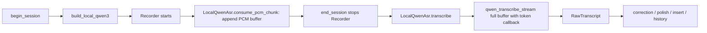

# 本地 ASR 快速出结果与兜底机制 Technical Spec

Status: confirmed
Requirements: docs/issues/local-asr-fast-live-results-fallback/local-asr-fast-live-results-fallback-requirements.md
Artifact: docs/issues/local-asr-fast-live-results-fallback/local-asr-fast-live-results-fallback-technical-spec.md
Implementation notes: docs/issues/local-asr-fast-live-results-fallback/local-asr-fast-live-results-fallback-implementation-notes.md

## Summary

本方案把 macOS `local-qwen3` 普通听写从“录音期间只缓存 PCM，停止后再整段伪流式转写”改为“普通听写 live-first，停止后 finalize；失败时使用完整 PCM buffer 走可靠 final fallback”。

核心设计是：

- 只对 macOS `local-qwen3` 普通听写启用 live path。
- 录音期间继续保留完整 PCM buffer，作为 fallback、调试录音和历史流程的可靠来源。
- 给 vendored Qwen C runtime 补充 app 可用的 live audio source API，不复用 stdin-only live reader。
- Rust 侧新增 live session wrapper、engine transcribe 串行保护、token payload 和计时日志。
- fallback 不复用当前带 token callback 的伪流式慢路径；fallback 清空 token callback 后走整段 final 转写。
- live worker 超时后不能被同一个 busy engine 卡死 fallback：如果 cancel 后短时间内无法释放 cached engine，fallback 必须使用一次性 fresh engine 或明确记录双路径失败。
- QA voice、Less Computer voice、历史重转写不纳入第一版 live path，但如果复用到底层代码必须不回归。

## Repository Evidence

- 已确认需求文档：`docs/issues/local-asr-fast-live-results-fallback/local-asr-fast-live-results-fallback-requirements.md`，状态为 `confirmed`。
- 仓库没有 `.codex/testing-profile.md` 或 `docs/ai/testing-profile.md`；验证计划需基于现有 npm/Cargo 脚本和新增专项测试。
- `openless-all/app/src-tauri/src/asr/local/local_provider.rs` 当前 `LocalQwenAsr` 在 `consume_pcm_chunk()` 中只把 16 kHz mono s16le PCM 追加到 `Vec<u8>`，`transcribe()` 停录后 clone buffer、转 f32、追加 0.5s silence、注册 token callback，再调用 `engine.transcribe_stream()`。
- `openless-all/app/src-tauri/src/asr/local/qwen_engine.rs` 当前只暴露 `transcribe_audio()`、`transcribe_stream()` 和全局 token callback，没有 live source wrapper，也没有 transcribe 级别串行锁。
- `openless-all/app/src-tauri/src/asr/local/qwen_ffi.rs` 当前 FFI 未声明 `qwen_transcribe_stream_live()` 或任何 live audio append/finalize API。
- `openless-all/app/src-tauri/vendor/qwen-asr/qwen_asr.h` 已有 `qwen_live_audio_t` 和 `qwen_transcribe_stream_live(ctx, live)`，并记录 per-run perf 字段。
- `openless-all/app/src-tauri/vendor/qwen-asr/qwen_asr_audio.h/c` 当前只导出 `qwen_live_audio_start_stdin()` / `qwen_live_audio_free()`；可 append 的 `live_audio_append()` 与 `live_audio_convert_and_append()` 是 `static`，app 不能直接喂实时 PCM。
- `openless-all/app/src-tauri/vendor/qwen-asr/qwen_asr.c` 的 `stream_impl(..., live)` 会在 live 模式等待 condvar 新音频、使用 encoder cache 和滑窗；非 live 且无 token callback 时会跳过 chunk loop，走 direct final refinement。
- `openless-all/app/src-tauri/src/recorder.rs` 的 cpal callback 同步调用 `AudioConsumer::consume_pcm_chunk()`，因此 live append 不能在该 callback 内做重计算或长时间阻塞。
- `openless-all/app/src-tauri/src/coordinator/dictation.rs` 当前普通听写在 `end_session()` 里先停 recorder，再按 provider 调 ASR，完成 raw ASR 后进入 correction、polish、insert、history。
- `openless-all/app/src-tauri/src/coordinator/asr_wiring.rs` 的 `build_local_qwen3()` 复用 `LocalAsrCache`，模型加载和 cache hit 已经有日志，但 release 行为需要避开 active live worker。
- `openless-all/app/src-tauri/src/coordinator/resources.rs` 当前 cancel 会取出 `ActiveAsr::Local` 并调用 `LocalQwenAsr::cancel()`；live worker 必须接入这个生命周期。
- `openless-all/app/src-tauri/src/types.rs` 和 `openless-all/app/src/lib/types.ts` 的 `CapsulePayload` 当前没有 session id；`local-asr-token` 事件也缺少 session-aware payload，需要随 live path 一起补齐，避免旧 session token 污染。

## Current Architecture

普通 macOS `local-qwen3` 听写当前路径：



这个路径的问题是：模型可能已 keep-loaded，但 ASR 计算仍主要发生在停止录音之后；并且当前注册 token callback 后调用 `qwen_transcribe_stream()`，C 侧会走 chunked pseudo-streaming loop，而不是 no-token direct final refinement。

## Proposed Design

### 1. Session Scope

第一版只改变普通 dictation session：

- `begin_session()` 中 macOS `local-qwen3` 且不是 QA、不是 Less Computer voice、不是历史重转写时，构建 live-enabled `LocalQwenAsr`。
- QA voice、Less Computer voice、历史重转写继续使用 batch/final `LocalQwenAsr` 或现有重转写路径。
- 现有 polish、translation、streaming insert、history、debug recording 语义不改变。

建议新增本地构造模式：

```rust
enum LocalQwenSessionMode {
    DictationLive { session_id: SessionId },
    BatchOnly,
}
```

`build_local_qwen3_for_dictation(inner, session_id)` 使用 `DictationLive`；现有 `build_local_qwen3(inner)` 可保留给 QA 和重转写，或改为显式 `BatchOnly`。

### 2. Qwen C Live Audio API

在 `vendor/qwen-asr/qwen_asr.h` / `qwen_asr_audio.h` / `qwen_asr_audio.c` 增加 app 可直接使用的 live source API：

```c
qwen_live_audio_t *qwen_live_audio_create(void);
int qwen_live_audio_append_s16le(qwen_live_audio_t *la, const uint8_t *buf, size_t n_bytes);
int qwen_live_audio_append_f32(qwen_live_audio_t *la, const float *samples, int n_samples);
void qwen_live_audio_finish(qwen_live_audio_t *la);
void qwen_live_audio_cancel(qwen_live_audio_t *la);
void qwen_live_audio_free(qwen_live_audio_t *la);
```

实现要求：

- `qwen_live_audio_t` 必须显式记录 ownership/thread 状态，例如 `reader_thread_started`、`app_owned`、`cancelled`，不能用 `pthread_t` 零值猜测线程是否已启动。
- `create()` 初始化 `samples`、`sample_offset`、`n_samples`、`capacity`、`eof`、`cancelled`、mutex、condvar 和 thread 状态，不启动 stdin reader thread。
- `append_s16le()` 复用现有 s16le -> f32 转换逻辑，追加后 signal condvar；实现时必须按 little-endian 字节显式组装 i16，避免把 `uint8_t*` 强转为可能未对齐的 `int16_t*`。
- `finish()` 设置 `eof=1` 并 signal，表示录音自然结束。
- `cancel()` 设置 `cancelled=1` 和 `eof=1` 并 signal，`stream_impl()` 看到 cancelled 后应尽快退出并返回 NULL 或空失败结果。
- `free()` 对 stdin-created live source 仍 join reader thread；对 app-created live source 不 join 未启动线程。
- `stream_impl()` 的 live wait loop 和 chunk 边界必须同时检查 `cancelled`，避免 cancel 后 worker 卡在 condvar；长 encode/decode 中途无法立即中断时，必须保证当前 chunk 结束后退出。

### 3. Rust FFI and Engine Wrapper

在 `qwen_ffi.rs` 增加不透明 live source 类型和 FFI：

```rust
#[repr(C)]
pub struct QwenLiveAudio {
    _opaque: [u8; 0],
}
```

并声明 `qwen_live_audio_create`、`qwen_live_audio_append_s16le`、`qwen_live_audio_append_f32`、`qwen_live_audio_finish`、`qwen_live_audio_cancel`、`qwen_live_audio_free`、`qwen_transcribe_stream_live`。

在 `qwen_engine.rs` 增加：

- `QwenLiveAudioSource` Rust RAII wrapper，Drop 时 cancel/free。
- `QwenAsrEngine::transcribe_stream_live(source)`，阻塞调用 `qwen_transcribe_stream_live()`。
- `QwenAsrEngine::transcribe_stream_final(samples)`，先清空 token callback，再调用 no-token final path。
- `QwenAsrEngine` 内部新增 `transcribe_lock: Mutex<()>`，保证同一个 `qwen_ctx_t` 不会被 live/fallback/batch 同时调用。
- token handler 必须在每次 transcribe 前按 source 显式设置，transcribe 结束后通过 guard 清理。
- `transcribe_stream_final()` 不应为 no-token final path 追加 live-only silence padding；如实测某模型仍需要尾部 padding，padding 只能作为 final-path 内部实现细节，不能计入 `RawTranscript.duration_ms`。
- `LocalQwenAsr` 需要持有 `model_id` 和 `model_dir`，用于 hard-stall fallback 时加载一次性 fresh engine。

### 4. LocalQwenAsr Live State Machine

`LocalQwenAsr` 从单纯 buffer provider 改为 session-scoped state machine：

```text
Idle -> Buffering
Buffering -> LiveStarting    when buffered audio >= 2s and session still recording
LiveStarting -> LiveRunning  when live worker entered qwen_transcribe_stream_live
LiveRunning -> Finalizing    when recorder stops and live source finish() is called
Finalizing -> LiveFinal      when live worker returns valid non-empty text
Finalizing -> Fallback       when live fails, times out, returns invalid, or is cancelled by fallback policy
Fallback -> FallbackFinal    when full PCM final transcription succeeds
Fallback -> Failure          when full PCM final transcription fails or returns empty
```

`consume_pcm_chunk()` 必须保持轻量：

- 继续把 PCM 追加到完整 fallback buffer。
- 通过 bounded non-blocking channel 把 PCM chunk 交给 feeder task/thread；推荐容量覆盖数秒音频，例如 64 个 recorder chunk。
- `consume_pcm_chunk()` 使用 `try_send` 或等效非阻塞路径；如果 feeder 满了，标记 live path unhealthy 并最终 fallback，但完整 PCM buffer 必须继续保留。
- 不在 cpal callback 内调用 C decoder，不做 f32 大规模转换，不等待 live worker。

live start policy：

- `LIVE_START_THRESHOLD_MS = 2000`。录音未达到 2 秒时只缓存 PCM；如果此时停止录音，直接走 `transcribe_stream_final()`。
- 录音达到 2 秒且当前 session 仍 recording 时，创建 live source，将已缓存 PCM 送入 source，启动 live worker。
- 后续 PCM chunk 由 feeder 持续 append 到 live source。

stop policy：

- `end_session()` 停止 recorder 后调用 `LocalQwenAsr::transcribe()`.
- `transcribe()` 记录 stop timestamp。
- 如果 live 未启动，走 direct final path。
- 如果 live 已启动，关闭 audio channel，调用 `live_source.finish()`，等待 live worker final。
- live final 等待预算应以 requirements 指标为主：短录音目标 1.5s，中等 3s，长录音 5s 或 60% baseline reduction。实现上可使用 `live_finalize_timeout(audio_secs)`，例如：
  - `<= 2s`: 不走 live。
  - `2-15s`: 3s finalize budget。
  - `15-60s`: 5s finalize budget。
  - `>60s`: `min(local_qwen_transcribe_timeout(audio_secs), ceil(audio_secs * 0.2) + 5s)`，并记录为超出第一版验收样本范围。

fallback policy：

- live source 创建失败、worker panic/JoinError、C 返回 NULL、文本为空、停止后超过 finalize budget、或 token/progress 长时间停滞时触发 fallback。
- fallback 触发前必须 cancel/finish live source，并等待 live worker 退出，避免同一 engine 并发转写。
- fallback 使用完整 PCM buffer 转 f32，并调用 `transcribe_stream_final()`；该路径必须清空 token callback，避免再次进入当前慢的 pseudo-stream token loop。
- 如果 live worker 在 `LIVE_CANCEL_JOIN_GRACE_MS`（建议 1000ms）内没有退出，fallback 不得无限等待同一个 cached engine。此时应：
  - 记录 `fallback_reason=live_cancel_grace_exceeded`。
  - 保留 cached engine busy 状态，直到旧 worker 自己退出。
  - 使用 `model_dir` 加载一次性 fresh `QwenAsrEngine` 跑 fallback final path。
  - fresh engine fallback 结束后立即 drop，不写入 `LocalAsrCache`。
  - 如果 fresh engine 加载或 fallback 失败，才按 both-path failure 处理。
- fallback 成功后继续现有 correction、polish、insert、history。
- live 和 fallback 都失败时，走现有 `fail_dictation()` / empty transcript 错误处理。

### 5. Timing and Observability

新增本地 ASR session metrics，至少记录：

- `session_id`
- `provider=local-qwen3`
- `model_id`
- `engine_cache=reuse|loaded`
- `audio_ms`
- `path=live|direct_final|fallback|failure`
- `live_start_ms_from_recording_start`
- `first_audio_chunk_ms`
- `first_token_ms_from_recording_start`
- `recording_stop_ms`
- `stop_to_final_raw_asr_ms`
- `fallback_trigger_reason`
- `fallback_engine=cached|fresh|none`
- `fallback_asr_ms`
- `total_asr_ms`
- `llm_polish_ms`
- `insert_ms`
- `stop_to_visible_or_inserted_text_ms`

日志建议统一前缀：

```text
[local-asr fast] session=<id> model=<id> path=<path> audio=<s>s live_start=<ms> first_token=<ms> stop_to_raw=<ms> fallback=<reason|none> fallback_engine=<cached|fresh|none>
[coord timing] session=<id> asr=<ms> llm=<ms|none> insert=<ms> stop_to_visible=<ms>
```

Coordinator 当前已有 ASR 和 LLM elapsed 传给 capsule；还需要补充 insertion elapsed 和 stop-to-visible 日志。UI 不新增设置项，fallback 默认 log-only。

### 6. Token Event Contract

live path 下 token 更早、更频繁，必须改为 session-aware payload。建议新增或替换事件 payload：

```ts
interface CapsulePayload {
  sessionId?: string
  // existing fields...
}

interface LocalAsrTokenPayload {
  sessionId: string
  provider: 'local-qwen3'
  source: 'live' | 'fallback'
  sequence: number
  piece: string
}
```

后端只为当前 session emit；`capsule:state` 的 visible/processing payload 携带同一个 `sessionId`，前端保存 active capsule session 并只接受同 session token。若保留旧 `local-asr-token` string 事件用于兼容，必须避免前端同时消费两个事件导致重复显示。

### 7. Cache and Release Safety

`LocalAsrCache` 需要避免释放仍被 live worker 使用的 engine：

- `release_now()` 和 `release_if_idle()` 在 macOS 上检查 cached engine 的 active strong refs 或新增 busy counter。
- 如果 session/live worker 正在使用 engine，release 请求应记录 `deferred_busy` 并保留 engine；不能 `slot.take()` 后让 UI 误以为已释放。
- `schedule_local_asr_release()` 在 `LocalQwenAsr::transcribe()` 完成、worker 已退出、fallback 已结束后调用。
- `QwenAsrEngine` 的 Arc 生命周期仍是最后防线，但产品行为上 release 状态也应与 busy 状态一致；fresh fallback engine 不参与 cache 状态。

## API / Interface Changes

### C Vendor API

- Add app live source functions listed in Proposed Design section 2.
- Add `cancelled` field to `qwen_live_audio_t` or equivalent internal cancellation state.
- Update `qwen_live_audio_free()` so stdin reader and app-created live source are both valid.

### Rust Backend API

- Add `QwenLiveAudioSource` RAII wrapper.
- Add engine transcribe lock and final no-token method.
- Add `LocalQwenSessionMode`.
- Add live-enabled constructor for normal dictation.
- Add `LocalAsrTokenPayload`.
- Add timing structs/helpers for local ASR and coordinator stop-to-visible logging.

### Frontend API

- Update `openless-all/app/src/lib/localAsr.ts` event type definitions.
- Update capsule listener only if token display is currently intended; listener must filter by `sessionId`.

## Data Model / Migration Changes

No persistent data migration is required.

Existing `DictationSession` history fields remain unchanged:

- `raw_transcript` still stores final raw ASR text.
- `final_text` still stores polished/translated/inserted text.
- `duration_ms` remains original recording duration, excluding live padding or fallback internals.
- `has_audio_recording` retains current debug/failure semantics.

## Error Handling and Compatibility

- live path errors are internal and automatically routed to fallback unless the user cancelled the session.
- fallback success is log-only and user-visible behavior remains normal transcript -> polish -> insert.
- both live and fallback failure produces the existing local ASR failure/empty transcript user path.
- cancellation sets session cancelled, stops recorder, cancels live source, clears fallback buffer when appropriate, and prevents stale token/text insertion.
- non-local ASR providers are not touched.
- Windows Foundry Local Whisper and sherpa-onnx are not touched.
- Apple Speech is not touched.
- QA voice, Less Computer voice, and history retranscription remain batch-only in first version.

## Files and Subsystems

- `openless-all/app/src-tauri/vendor/qwen-asr/qwen_asr.h`
- `openless-all/app/src-tauri/vendor/qwen-asr/qwen_asr_audio.h`
- `openless-all/app/src-tauri/vendor/qwen-asr/qwen_asr_audio.c`
- `openless-all/app/src-tauri/vendor/qwen-asr/qwen_asr.c`
- `openless-all/app/src-tauri/src/asr/local/qwen_ffi.rs`
- `openless-all/app/src-tauri/src/asr/local/qwen_engine.rs`
- `openless-all/app/src-tauri/src/asr/local/local_provider.rs`
- `openless-all/app/src-tauri/src/asr/local/cache.rs`
- `openless-all/app/src-tauri/src/types.rs`
- `openless-all/app/src-tauri/src/coordinator/asr_wiring.rs`
- `openless-all/app/src-tauri/src/coordinator/dictation.rs`
- `openless-all/app/src-tauri/src/coordinator/capsule_focus.rs`
- `openless-all/app/src-tauri/src/coordinator/resources.rs`
- `openless-all/app/src-tauri/src/components/Capsule.tsx`
- `openless-all/app/src/lib/types.ts`
- `openless-all/app/src/lib/localAsr.ts`

## Requirements Coverage Matrix

| Requirement | Technical coverage | Validation coverage | Status |
| --- | --- | --- | --- |
| macOS `local-qwen3` 普通听写录音期间启动 ASR | `LocalQwenSessionMode::DictationLive` + 2s threshold live start + C live source API | short/medium/long manual logs verify live_start and first_token | Covered |
| 停止录音后快速拿到 raw ASR | live finalize budget + stop-to-final raw ASR metrics | SLO checks for <=1.5s, <=3s, <=5s or 60% reduction | Covered |
| live 不可用/失败时 fallback | fallback policy using full PCM buffer and no-token final path | forced live start fail, timeout, invalid result tests | Covered |
| fallback 默认用户无感 | log-only fallback; user-visible error only if both paths fail | manual fallback success confirms normal polish/insert | Covered |
| 日志拆分 ASR/LLM/insert | local ASR metrics + coordinator insertion/stop-to-visible logs | static log checks + manual log sample inspection | Covered |
| 短句可 direct/final | live start threshold below 2s uses direct final | short recording manual sample and unit state tests | Covered |
| 中长录音边录边处理 | live worker begins after first 2s and consumes later chunks through feeder | medium/long samples verify live path source | Covered |
| 取消/快速重录不污染 session | session-aware token payload, cancel live source, join worker, current session filtering | cancel and rapid re-record regression scenarios | Covered |
| 引擎释放不能发生在 worker 持有时 | cache busy/strong-ref release deferral + transcribe lock | release-while-recording manual test and unit release guard | Covered |
| 录音 callback 不阻塞 | consume only buffers + sends chunk to feeder; C append off callback | recorder log stability and no callback watchdog errors | Covered |
| live hard-stall 仍可 fallback | cancel grace + one-shot fresh fallback engine when cached engine remains busy | forced hard-stall fallback test | Covered |
| 保持模型选择/keep-loaded/历史/调试录音/插入 | keep `LocalAsrCache`, `RawTranscript`, history and insertion contracts | non-regression checks for history/debug/insertion | Covered |
| 非本地 provider 不变 | scope-gated macOS `local-qwen3` only | smoke tests with cloud provider config untouched/static diff | Covered |
| QA/Less Computer/history retranscription不进第一版 | mode gating: normal dictation only; BatchOnly preserved | static path check and targeted manual no-regression | Covered |
| 基线对比与 forced fallback 验证 | validation plan requires before/after same samples and debug failure knobs | validation plan automated/manual sections | Covered |

Coverage audit result: the proposed design fully covers the confirmed requirements. No requirement conflict was found during technical planning.

## Risks

- The C live API touches vendored runtime and stream loop cancellation; memory ownership and condvar wakeups need careful review.
- `spawn_blocking` work cannot be force-aborted by Tokio; C cancellation must be fast enough for cancel/fallback to be reliable.
- Starting live at 2s is a deliberate short-audio optimization. If real samples show first-token latency suffers for 2-5s utterances, threshold should be adjusted inside the same requirement scope.
- Real performance cannot be fully validated in CI because the Qwen model is large and machine-dependent; manual local validation is required.

## Human Decisions Required

- None beyond confirmation of this technical spec, development plan, and validation plan.
- After confirmation, route to `issue-delivery` for implementation.
